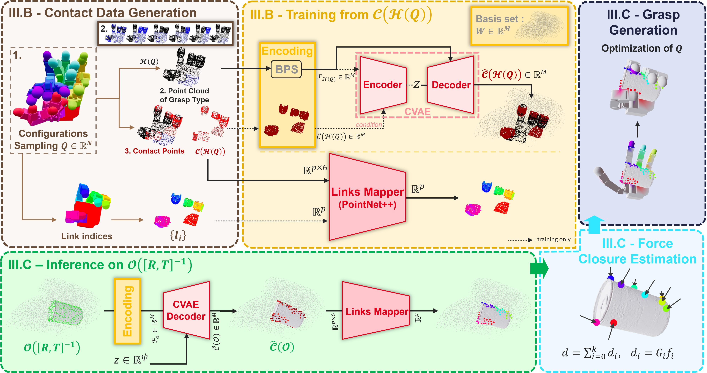

# **GOAG: Generative and Object-Agnostic Grasp Planner for Dexterous Robotic Manipulation** 

<div align="center">

#### [Julien Mérand](https://julienmerand.github.io/portfolio/)<sup>1</sup>, &nbsp;&nbsp; [Boris Meden](https://scholar.google.com/citations?user=knXPf8oAAAAJ&hl=fr)<sup>1</sup>, &nbsp;&nbsp; [Mathieu Grossard](mailto:mathieu.grossard@cea.fr)<sup>1</sup>, &nbsp;&nbsp; [Liming Chen](https://scholar.google.com/citations?user=VOPW5YYAAAAJ&hl=fr)<sup>2</sup>

#### <sup>1</sup>Université Paris-Saclay, CEA-List &nbsp;&nbsp; <sup>2</sup>École Centrale de Lyon, CNRS, LIRIS, UMR5205, Institut Universitaire de France (IUF)
#### 2026 IEEE/RSJ International Conference on Intelligent Robots and Systems (IROS)

### [**Project Page**](https://cea-list.github.io/goagweb/) &nbsp;&nbsp;|&nbsp;&nbsp; [**arXiv**](https://arxiv.org/abs/arxiv_paper_id) &nbsp;&nbsp;|&nbsp;&nbsp; [**BibTeX**](#-citation--contact)
</div>

<div align="center" style="background-color: white; padding: 2px;">
  
</div>

**GOAG** is novel deep generative model that learns a compact latent representation of a specific gripper's contact surface distribution, enabling the efficient sampling of valid grasp configurations without relying on object-specific training data. 
By introducing object features only at inference time, GOAG can effectively retrieve admissible contact areas that are compatible with the gripper’s capabilities.


## ⚙️ Installation

Due to the conflicting Python version requirements of GOAG and Isaac Gym, it is **highly recommended** to set up two separate Conda environments: one for generation, and one for simulation.

### Training and Grasp Synthesis
Use this environment for training the models and generating grasps.

- **Requirements:** Python 3.12, PyTorch 2.4.1
- **Setup:**
    ```bash
    # Create the environment
    conda create -n goag python=3.12
    conda activate goag

    # Install PyTorch with CUDA 12.1 (adjust if necessary)
    pip install torch==2.4.1+cu121 torchvision==0.19.1+cu121 torchaudio==2.4.1 --index-url https://download.pytorch.org/whl/cu121

    # Standard requirements
    pip install -r goag_requirements.txt
    ```

### (Optional) Evaluation with Isaac Gym - Python 3.8
If you plan to physically validate the synthesized grasps in simulation, you must use Python 3.8 to support [Isaac Gym](https://developer.nvidia.com/isaac-gym-preview-4).  

- **Requirements:** Python 3.8, PyTorch 2.4.1
- **Setup:**
    ```bash
    # Create the environment
    conda create -n goag_isaac python=3.8
    conda activate goag_isaac

    # Install PyTorch with CUDA 12.1 (adjust if necessary)
    pip install torch==2.4.1+cu121 torchvision==0.19.1+cu121 torchaudio==2.4.1 --index-url https://download.pytorch.org/whl/cu121

    # Standard requirements
    pip install -r isaac_requirements.txt
    ```

- **Install [Isaac Gym](https://developer.nvidia.com/isaac-gym-preview-4):**
    ```bash
    tar -xvf IsaacGym_Preview_4_Package.tar.gz
    cd isaacgym/python
    pip install -e .
    ```


## 📂 Setup and Data

### 1. Download Data and Models
Start by downloading the necessary data and pre-trained model checkpoints.

- **Datasets & Objects:** Download the file [GOAG_DATA](https://github.com/CEA-LIST/GOAG/releases/tag/v1.0) containing all gripper and object data. 
    - Available Datasets: `dexgrab`, `realdex`, `dexgraspnet`, `unidexgrasp`, `multidex`
    - Supported Grippers: `barrett`, `allegro`, `shadowhand`

- **Model Checkpoints:** Download the pre-trained [weights](https://github.com/CEA-LIST/GOAG/releases/tag/v1.0) for the Shadow Hand, Allegro Hand and Barrett.

### 2. Organize Directories

Extract the files `ckpts.zip` and `GOAG_DATA.zip`. Your directory tree should strictly follow this structure:
```bash
# Model Checkpoints
GOAG                        # Main folder
├── ...
├── logs                    # ckpts folder
    ├── allegro_cvae
    ├── allegro_pointnet
    ├── barrett_cvae
    ├── barrett_pointnet
    ├── shadowhand_cvae
    └── shadowhand_pointnet
└── ...

# Dataset Directory
GOAG_DATA
├── handprints
├── pointclouds
    ├── dexgrab
    ├── dexgraspnet
    ├── multidex
    ├── realdex
    └── unidexgrasp
├── urdf
    ├── objects
    │   ├── dexgrab
    │   ├── dexgraspnet
    │   ├── multidex
    │   ├── realdex
    │   └── unidexgrasp
    └── robot
        ├── allegro
        ├── barrett
        └── shadowhand
└── workspaces
```

### 3. Tell GOAG Where Your Data Is

Choose one of the following methods to link the code to your data:

**Option A: Export Environment Variables**  
```bash
export PYTHON_HOME_PATH='path/to/parent/of/GOAG'
export PYTHON_DATA_PATH='path/to/parent/of/GOAG_DATA/'
```

**Option B: Hardcode in `constants.py`**  
Directly edit the `ROOT_PATH` and `DATA_PATH` variables within the file `utils\constants.py`.


## 🚀 Usage Guide

### 1. Training a New Model
To train the model from scratch on a specific robot:

| Model | Command |
| :--- | :--- |
| **CVAE** | ```python train.py --model='cvae' --robot_name='allegro' --train_name='example_cvae'``` |
| **PointNet++** | `python train.py --model='pointnet' --robot_name='allegro' --train_name='example_pointnet'` |

💡 **Note:** To resume training from a checkpoint, simply append the `--resume` flag.


### 2. Grasp Synthesis (Inference)

Once trained, you can synthesize grasps for unseen objects.

```bash
python utils_validation/validate_models.py --robot_name="allegro" --radius=0.01 --dataset="multidex"
```
- `--radius`: Distance between robot palm and objects convex hull for $[R,t]$ sampling.

### 3. Validation in Isaac Gym

To test the physical stability of your generated grasps in a physics engine:

```bash
# Make sure to activate your Isaac Gym environment first!
conda activate goag_isaac

python utils_validation/validate_isaac.py --robot_name="allegro" --radius=0.01 --dataset="multidex"
```


## 🛠️ Applying GOAG to a New Gripper

To add your own robotic hand:
1. **Import Assets:** Place your robot's URDF and Mesh files into `GOAG_DATA/urdf/robot/`
3. **Update Metadata:** Register the paths to your new files inside `GOAG_DATA/urdf/robot/urdf_assets_meta.json`.
4. **Generate the Data:** Run `data_generation.py`. This script mathematically explores the kinematics of your new gripper to generate its specific **handprints** and **canonical workspace**.


## 📚 Citation & Contact

If you find this work helpful for your research, please consider citing us:

```
@inproceedings{merand2026goag,
  title={GOAG: Generative and Object-Agnostic Grasp Planner for Dexterous Robotic Manipulation},
  author={Mérand, Julien and Meden, Boris and Grossard, Mathieu and Chen, Liming},
  booktitle={2026 IEEE/RSJ International Conference on Intelligent Robots and Systems (IROS)},
  year={2026},
  url={https://cea-list.github.io/goagweb/}
}
```

**Questions or Issues?** Feel free to open an issue on GitHub or reach out directly to **Julien Mérand** at [julien.merand@cea.fr](mailto:julien.merand@cea.fr).


